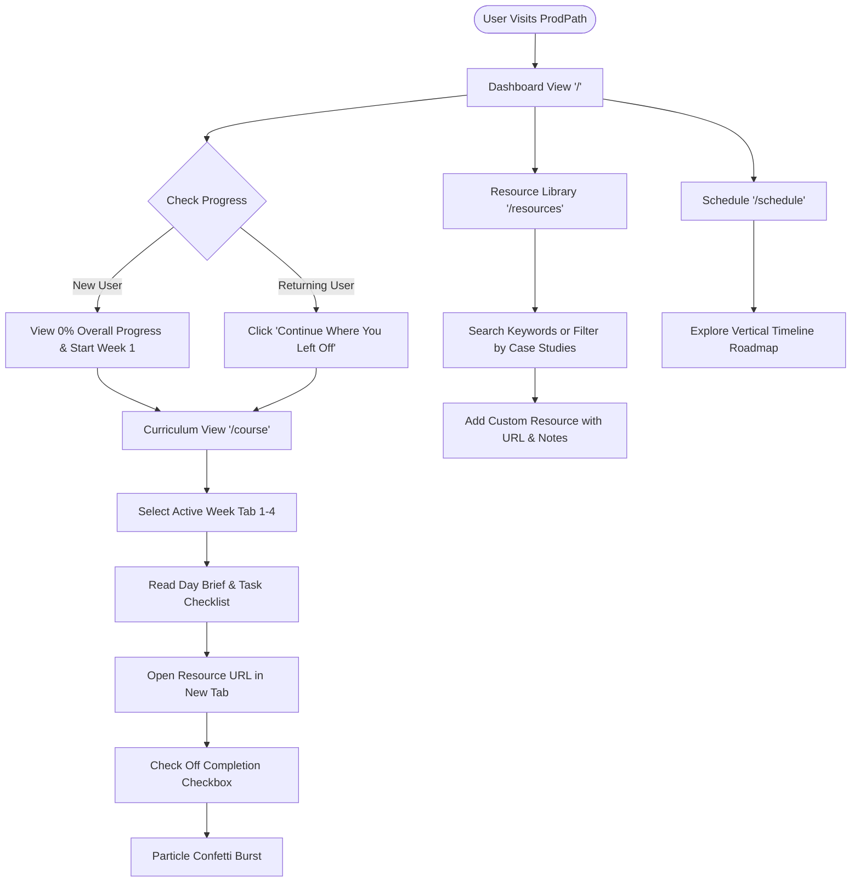

# ProdPath — Product Vision & Functional Specification (Product Spec)

> **Document Status**: Approved / Permanent Reference  
> **Product Name**: ProdPath  
> **Target Version**: 1.0.0+  
> **Repository Path**: `d:\ProdPath`  

---

## Table of Contents
1. [Product Vision & Mission](#1-product-vision--mission)
2. [Problem Statement & Solution](#2-problem-statement--solution)
3. [Target Audience & User Personas](#3-target-audience--user-personas)
4. [Competitive Landscape & Advantage](#4-competitive-landscape--advantage)
5. [Comprehensive Feature Specifications](#5-comprehensive-feature-specifications)
6. [User Journey & Experience Architecture](#6-user-journey--experience-architecture)
7. [Product & AI Feature Roadmap](#7-product--ai-feature-roadmap)

---

## 1. Product Vision & Mission

### Startup Elevator Pitch
For aspiring Product Managers overwhelmed by fragmented learning materials across Medium, YouTube, and podcasts, **ProdPath** is a modern, interactive learning platform that structures the PM journey into an actionable 4-week syllabus with real-time progress tracking, reflective case studies, masterclasses, and custom resource management. Unlike static reading lists or expensive course portals, ProdPath is free, instant, locally persistent, and beautifully designed for daily focus.

### Vision Statement
To become the definitive, open-access learning platform for product managers to master product strategy, execution, technical fluency, data analytics, case studies, and interview excellence.

### Mission Statement
To empower every aspiring product leader with structured, accessible knowledge, actionable daily tracking, and intuitive tools that accelerate career transitions.

### Core Values
1. **Zero-Friction Access**: No registration walls; learning begins instantly.
2. **Local-First Privacy**: Learner data rests securely inside local browser storage.
3. **Visual Excellence**: Refined dark mode (`#0a0a0f`), light mode (`#faf9f6`), Space Grotesk/Inter typography, and fluid WebGL graphics inspire daily commitment.
4. **Actionable Curations**: Quality over quantity — every reading, video, case study, and assignment is selected for high-impact PM execution.

---

## 2. Problem Statement & Solution

### The Problem
Self-studying Product Management is notoriously fragmented:
- **Content Overload**: Thousands of unstructured PM blogs, frameworks (RICE, CIRCLES, AARRR, HEART), podcasts, and YouTube channels exist without clear sequencing.
- **Progress Drift**: Learners lose track of what they read 3 weeks ago without a central completion ledger.
- **High LMS Barrier**: Commercial PM bootcamps cost thousands of dollars, while free lists offer zero interactive progress tracking.

### The ProdPath Solution
- **Structured 4-Week Roadmap**: Breaks down PM mastery into 28 daily modules spanning PM Foundations, Metrics & Strategy, Tech/AI Tools, and Interview Prep.
- **Horizontal Week Tab Navigation**: Easily switch between Week 1–4 modules with glassmorphic active tab indicators.
- **Interactive Progress Dashboard**: Visual meters, completion badges, next-up recommendation banners, and confetti micro-animations upon task completion.
- **Case Studies Repository**: Reflective case studies (`case-study` resource type) with bulleted takeaways and dedicated progress counters.
- **Vertical Timeline Schedule**: Chronological 28-day roadmap rail with timeline nodes and filter controls.
- **Custom Resource Extension**: Allows users to inject custom articles/videos with target week tags and personal notes directly into their local syllabus.

---

## 3. Target Audience & User Personas

### Target Demographics
- **Primary**: Self-taught PM candidates, career switchers (engineers, designers, marketers, data analysts), APMs.
- **Secondary**: Bootcamp students, university graduates, product operations managers.

---

## 4. Competitive Landscape & Advantage

| Dimension | Generic Medium Lists | Paid PM Bootcamps | Notion Templates | ProdPath |
| :--- | :--- | :--- | :--- | :--- |
| **Cost** | Free | $2,000 – $6,000 | Free – $50 | **100% Free** |
| **Interactive Tracking** | ❌ None | ✅ Yes | ⚠️ Manual Checkboxes | ✅ **Automated Local Storage** |
| **Case Studies Hub** | ❌ No | ⚠️ Generic PDFs | ❌ No | ✅ **Interactive Takeaways + Progress** |
| **Custom Resource Addition**| ❌ No | ❌ Fixed Syllabus | ✅ Manual Rows | ✅ **Custom Modal Injection** |
| **Visual Aesthetics** | ❌ Static Text | ⚠️ Standard LMS | ⚠️ Plain Layout | ✅ **WebGL Fluid Canvas + Space Grotesk Design System** |
| **Setup Time** | Instant | Multi-week Approval | Duplicate Template | **Instant (Zero Sign-up)** |

---

## 5. Comprehensive Feature Specifications

### 5.1 Dashboard Category
- **Hero Progress Widget**: Calculates overall completion percentage across static curriculum + live sessions + case studies + custom resources.
- **"Continue Where You Left Off"**: Signature glassmorphic surface card rendering the exact next uncompleted resource item.
- **Progress Breakdown Cards**: Displays per-week, live sessions, and case studies percentage meters with direct links.

### 5.2 Curriculum & Learning Roadmap Category
- **Horizontal Week Navigation Tabs**: Week 1–4 horizontal tab bar featuring active week tab glass glow.
- **Day-by-Day Task Breakdown**: Day 1..5 vertical list rendering day briefs, task sections, and resource cards under the active week.
- **Resource Completion Checkbox**: Interactive button that mutates completion Set, triggers confetti burst, and updates `localStorage`.

### 5.3 Resource Library & Search Category
- **Keyword Text Search**: Real-time filtering matching queries against resource titles, personal notes, summaries, and takeaways.
- **Multi-Dropdown Filtering**: Filter by Week (`All`, `Week 1-4`, `Custom`), Type (`Article`, `Video`, `Playlist`, `Case Study`), and Status (`Completed`, `Pending`).
- **Case Studies Progress Counter**: Dedicated metric badge rendering total completed/total case studies (`X/Y Completed`).

### 5.4 Live Sessions Watch List Category
- **On-Demand Masterclass Hub**: Tracks video masterclasses from top industry leaders (Shreyas Doshi, Lenny Rachitsky, Marty Cagan).
- **Session Progress Meter**: Displays watched count (`X/Y Watched`) and percentage bar.

### 5.5 Schedule Category
- **Vertical Timeline Rail + Nodes**: Chronological timeline roadmap displaying date pillars (`font-mono`), day of week, week tag, topic description, and milestone type badge (`Resources`, `Assessment`, `Capstone`).

---

## 6. User Journey & Experience Architecture

---

## 7. Product & AI Feature Roadmap

### Short-Term Roadmap (P0 — Immediate)
- **JSON Import/Export**: Allow users to export progress JSON for cross-device backup.
- **Custom Confirmation Modal**: Replace native `confirm()` dialog on progress reset.

### Medium-Term Roadmap (P1 — Next Release)
- **AI PM Case Interview Simulator**: Interactive chat agent posing Product Sense and Execution case questions.
- **PRD Review Assistant**: AI tool analyzing user product specs against industry templates.

### Long-Term Roadmap (P2 — Strategic Vision)
- **Cloud Sync & User Accounts**: Optional Supabase authentication for seamless cross-device synchronization.
- **Community Resource Hub**: Allow users to share and vote on custom PM learning paths.
