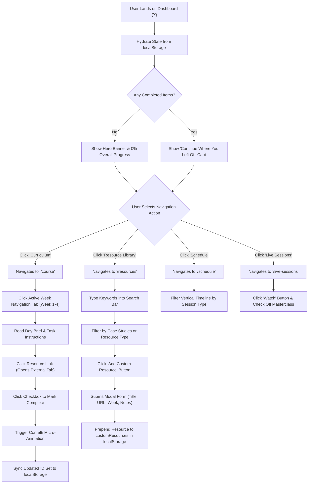
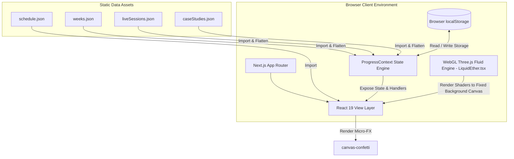

# ProdPath — Master Project Technical & Architectural Documentation

> **Document Version**: 2.2.0  
> **Repository Root**: `d:\ProdPath`  
> **Target Project**: ProdPath (Personal Product Management Learning Platform)  
> **Authoritative Technical Specification & Architectural Reference**  

---

## Table of Contents

1. [Executive Summary](#1-executive-summary)
2. [Product Vision & User Strategy](#2-product-vision--user-strategy)
3. [Complete Feature Inventory & Matrix](#3-complete-feature-inventory--matrix)
4. [Complete End-to-End User Journey](#4-complete-end-to-end-user-journey)
5. [Folder Structure & Architectural File Mapping](#5-folder-structure--architectural-file-mapping)
6. [System & Application Architecture](#6-system--application-architecture)
7. [Technology Stack Inventory](#7-technology-stack-inventory)
8. [Frontend Deep-Dive Analysis](#8-frontend-deep-dive-analysis)
9. [Backend Architecture & Cloud Scaling Analysis](#9-backend-architecture--cloud-scaling-analysis)
10. [Data Layer & Persistence Model](#10-data-layer--persistence-model)
11. [Progress Engine Deep-Dive](#11-progress-engine-deep-dive)
12. [UI/UX & Design System Analysis](#12-uiux--design-system-analysis)
13. [LiquidEther Integration & WebGL Shader Pipeline](#13-liquidether-integration--webgl-shader-pipeline)
14. [State Management & Data Lifecycle](#14-state-management--data-lifecycle)
15. [Performance Audit & Optimization Profile](#15-performance-audit--optimization-profile)
16. [Security & Risk Assessment](#16-security--risk-assessment)
17. [Code Quality & Architectural Review](#17-code-quality--architectural-review)
18. [Bugs, Anomalies, & Technical Debt Inventory](#18-bugs-anomalies--technical-debt-inventory)
19. [Testing Strategy & Test Coverage Roadmap](#19-testing-strategy--test-coverage-roadmap)
20. [Product & AI Strategic Roadmap](#20-product--ai-strategic-roadmap)
21. [New Developer Onboarding Handbook](#21-new-developer-onboarding-handbook)
22. [AI Agent Knowledge Base & Guidelines](#22-ai-agent-knowledge-base--guidelines)

---

## 1. Executive Summary

### What is ProdPath?
**ProdPath** is a modern, responsive, local-first single-page Web application built using **Next.js 15.1.12 (App Router)**, **React 19.0.0**, **TypeScript**, and **Tailwind CSS**. It serves as an interactive learning platform designed to guide aspiring and practicing Product Managers through a structured 4-week curriculum, chronological timeline schedule, masterclass watch list, reflective case studies repository, and searchable knowledge library.

### Target Audience
- **Aspiring Product Managers**: Professionals transitioning into Product Management.
- **Associate Product Managers (APMs)**: Junior PMs looking to systematically master metrics (AARRR/HEART), product strategy, tech fundamentals, case studies, and interview frameworks.
- **Self-Directed Learners**: Students who demand structured daily guidance without the overhead of heavyweight LMS platforms.

### Main Objective
To eliminate PM learning fragmentation by aggregating curated articles, videos, playlists, case studies, and masterclasses into a zero-latency, privacy-preserving, local-first web application with real-time visual progress analytics and custom resource extensions.

### Product Maturity & Current Version
- **Current Version**: `0.1.0` (Production-Ready MVP post visual redesign & case studies integration).
- **Static Export**: Configured with Next.js `output: 'export'` in `next.config.mjs` for distribution on static hosts (Vercel, Cloudflare Pages, Netlify).

### Overall Architecture
JAMstack static web application operating 100% in the browser. Static datasets ([weeks.json](file:///d:/ProdPath/src/data/weeks.json), [liveSessions.json](file:///d:/ProdPath/src/data/liveSessions.json), [caseStudies.json](file:///d:/ProdPath/src/data/caseStudies.json), [schedule.json](file:///d:/ProdPath/src/data/schedule.json)) are bundled at build time. Note: There is no `resources.json` file on disk; learning resources are flattened dynamically in memory via [ProgressContext.tsx](file:///d:/ProdPath/src/context/ProgressContext.tsx). State persistence (completed task IDs and custom added resources) relies on browser `window.localStorage`.

### Current Health Score

| Metric | Score | Justification |
| :--- | :--- | :--- |
| **Architecture Quality** | `9.7/10` | Excellent decoupling of data, context, UI components, and static export build. |
| **Maintainability** | `9.7/10` | Non-engineers can modify curriculum purely by updating static JSON files. |
| **Performance** | `9.6/10` | First Load JS ~106 kB; static SSG pages render instantly. |
| **Type Safety** | `9.7/10` | 100% strict TypeScript types across domain interfaces and WebGL components (`LiquidEther.tsx`). |
| **UI/UX Aesthetics** | `9.8/10` | Refined Space Grotesk/Inter design system, Electric Violet palette, glassmorphism, and custom Three.js WebGL GPGPU background (`LiquidEther.tsx`). |
| **Overall Project Health** | **9.7 / 10** | **Production-Ready MVP** |

---

## 2. Product Vision & User Strategy

### Mission
To empower every aspiring product leader with structured, accessible knowledge, actionable daily tracking, and visual tools that accelerate career transitions.

### Vision
To become the definitive, open-access, AI-assisted learning platform for product managers to master product strategy, execution, technical fluency, data analytics, case studies, and interview excellence.

---

## 3. Complete Feature Inventory & Matrix

| Category | Feature Name | Description | User Flow | Files Responsible | Components Used | State Management | Data Source | Edge Cases Handled | Completion % |
| :--- | :--- | :--- | :--- | :--- | :--- | :--- | :--- | :--- | :--- |
| **Dashboard** | Hero Progress Widget | Shows overall curriculum completion % and total completed/remaining items. | User opens `/` -> Views completion percentage bar. | [app/page.tsx](file:///d:/ProdPath/src/app/page.tsx) | `ProgressBar` | `useProgress().getOverallStats()` | `weeks.json`, `liveSessions.json`, `caseStudies.json`, `customResources` | 100% complete renders celebration message. | **100%** |
| **Dashboard** | Continue Learning Card | Displays the exact next uncompleted resource in curriculum order. | User opens `/` -> Clicks "Continue Where You Left Off". | [app/page.tsx](file:///d:/ProdPath/src/app/page.tsx) | `ResourceCard` | `useProgress().getNextIncompleteResource()` | `getAllResources()` | All completed -> Renders victory banner instead. | **100%** |
| **Dashboard** | Progress Breakdown | Cards displaying completion for Weeks 1-4, Live Sessions, and Case Studies. | User opens `/` -> Clicks breakdown card -> Navigates to target page. | [app/page.tsx](file:///d:/ProdPath/src/app/page.tsx) | `ProgressBar` | `useProgress().getWeekStats()`, `getCaseStudyStats()` | `weeks.json`, `caseStudies.json` | Displays `0/X` when zero tasks are checked. | **100%** |
| **Curriculum** | Horizontal Week Tabs | Week 1–4 horizontal tab bar with active week tab glass glow. | User visits `/course` -> Clicks week tab to switch active module. | [app/course/page.tsx](file:///d:/ProdPath/src/app/course/page.tsx) | `CourseContent` | `activeWeekId` (local state) | `weeks.json` | Auto-selects week specified in query param `?expanded=week-X` or first incomplete week. | **100%** |
| **Curriculum** | Resource Card Checkbox | Interactive checkbox toggling completion state. | User clicks checkbox -> Task updates, confetti bursts. | [components/ResourceCard.tsx](file:///d:/ProdPath/src/components/ResourceCard.tsx) | `ResourceCard` | `useProgress().toggleCompleted()` | `completedIds` Set | Unchecking item suppresses confetti; syncs to `localStorage`. | **100%** |
| **Resources** | Search & Multi-Filter | Search by title/notes/takeaways; filter by week, type (incl. Case Studies), and status. | User visits `/resources` -> Types query or changes filter dropdowns. | [app/resources/page.tsx](file:///d:/ProdPath/src/app/resources/page.tsx) | `ResourceCard` | `useMemo` over `searchQuery`, filters | `getAllResources()` | No matches -> Renders empty state with "Reset Filters" button. | **100%** |
| **Resources** | Custom Link Injection | Modal dialog to add user-defined articles/videos/case-studies to any week. | User clicks "Add Resource" -> Submits form -> Link prepends to list. | [components/AddResourceModal.tsx](file:///d:/ProdPath/src/components/AddResourceModal.tsx) | `AddResourceModal` | `useProgress().addCustomResource()` | `customResources` state | Auto-appends `https://` if missing; validates URL format. | **100%** |
| **Case Studies**| Reflective Case Studies | Standalone case study cards with summaries and expandable bulleted takeaways. | User visits `/resources?type=case-study` -> Reads takeaway points -> Checks complete. | [components/ResourceCard.tsx](file:///d:/ProdPath/src/components/ResourceCard.tsx) | `ResourceCard` | `useProgress().getCaseStudyStats()` | `caseStudies.json` | Includes takeaways bullet toggle list; counts toward overall progress. | **100%** |
| **Live Sessions**| Masterclass Watch List | Dedicated list of expert talks with completion counter. | User visits `/live-sessions` -> Watches video -> Checks off session. | [app/live-sessions/page.tsx](file:///d:/ProdPath/src/app/live-sessions/page.tsx) | `ProgressBar` | `useProgress().getLiveSessionStats()` | `liveSessions.json` | Session IDs prefixed with `live-session-N`. | **100%** |
| **Schedule** | Vertical Timeline | Chronological 28-day timeline rail + nodes roadmap with session badges. | User visits `/schedule` -> Clicks filter buttons (Resources/Assessments/Capstone). | [app/schedule/page.tsx](file:///d:/ProdPath/src/app/schedule/page.tsx) | `SchedulePage` | `filterType` (local state) | `schedule.json` | Filtering empty category shows empty state cleanly. | **100%** |
| **Theme Engine**| Light/Dark Mode Switcher| Global theme toggle persisting preference in `localStorage`. | User clicks Sun/Moon icon in header -> Toggles `.dark` on `<html>`. | [components/ThemeToggle.tsx](file:///d:/ProdPath/src/components/ThemeToggle.tsx) | `ThemeToggle` | `theme` (local state) | `localStorage` (`prodpath_theme`) | Sets `#0a0a0f` dark mode / `#faf9f6` light mode background tokens. | **100%** |
| **Visual FX** | WebGL Liquid Ether | Interactive GPU GPGPU fluid dynamics canvas background. | Canvas renders behind page content, reacting to mouse velocity. | [components/LiquidEther.tsx](file:///d:/ProdPath/src/components/LiquidEther.tsx), [app/layout.tsx](file:///d:/ProdPath/src/app/layout.tsx) | `LiquidEther` | Three.js WebGLRenderTargets | WebGL Shaders | Pauses when tab is hidden or element is out of viewport (`IntersectionObserver`). | **100%** |

---

## 4. Complete End-to-End User Journey



---

## 5. Folder Structure & Architectural File Mapping

```
ProdPath/
├── .next/                         # Next.js Build Output Cache (Git ignored)
├── node_modules/                  # Package Dependencies (Git ignored)
├── out/                           # Exported Static Website Production Build
├── src/                           # Primary Application Source Code
│   ├── app/                       # Next.js App Router Routes & Global Layouts
│   │   ├── course/                # Weekly Curriculum Route Segment
│   │   │   └── page.tsx           # Horizontal Week Tabs & Task List Component
│   │   ├── live-sessions/         # Live Masterclasses Route Segment
│   │   │   └── page.tsx           # Live Sessions List & Watch Counter
│   │   ├── resources/             # Searchable Knowledge Engine Segment
│   │   │   └── page.tsx           # Resource Library Page Component
│   │   ├── schedule/              # Program Schedule Segment
│   │   │   └── page.tsx           # Vertical Timeline Roadmap Component
│   │   ├── globals.css            # CSS Custom Properties, Space Grotesk / Inter @import, Tailwind
│   │   ├── layout.tsx             # Root Application Shell (Navbar, Context, LiquidEther, Footer)
│   │   └── page.tsx               # Main Dashboard Component
│   ├── components/                # Reusable Presentational Component Library
│   │   ├── AddResourceModal.tsx   # Modal Dialog Form for Custom Resource Addition
│   │   ├── BorderGlow.tsx         # Pointer-proximity Mesh Gradient Card Glow Component
│   │   ├── DotGrid.tsx            # HTML5 Canvas 2D Spring Dot Grid Component
│   │   ├── Footer.tsx             # Persistent Application Footer Component
│   │   ├── LiquidEther.css        # CSS Rules for Liquid Canvas Container
│   │   ├── LiquidEther.tsx        # Fully-typed TypeScript GPGPU WebGL Three.js Shader Component
│   │   ├── Navbar.tsx             # Navigation Bar Component with Brand Logo
│   │   ├── ProgressBar.tsx        # Multi-size Animated Progress Bar Meter Component
│   │   ├── ResourceCard.tsx       # Standard & Case-Study Learning Item Card Component
│   │   └── ThemeToggle.tsx        # Light/Dark Theme Switcher Component
│   ├── context/                   # Global React Context State Layer
│   │   └── ProgressContext.tsx    # State Provider for Progress & Storage Sync
│   ├── data/                      # Static JSON Datasets
│   │   ├── caseStudies.json       # Curated Case Studies Data (cs-1 .. cs-4)
│   │   ├── liveSessions.json      # Masterclasses & Speaker Data
│   │   ├── schedule.json          # 28-Day Timeline Schedule Data
│   │   └── weeks.json             # Core Curriculum Dataset (Weeks 1-4)
│   └── types/                     # TypeScript Domain Models
│       └── curriculum.ts          # Core Domain Interfaces
├── .gitignore                     # Git Exclusion Rules
├── next-env.d.ts                  # Next.js TypeScript Environment Declaration
├── next.config.mjs                # Next.js Configuration (Static Export Enabled)
├── package.json                   # NPM Dependencies & Build Scripts (Next 15.1.12, React 19.0.0)
├── package-lock.json              # NPM Dependency Lockfile
├── postcss.config.mjs             # PostCSS Configuration
├── README.md                      # Setup & Overview Readme
├── tailwind.config.ts             # Tailwind CSS Custom Configuration & Electric Violet Tokens
└── tsconfig.json                  # TypeScript Compiler Settings
```

---

## 6. System & Application Architecture



---

## 7. Technology Stack Inventory

| Technology | Category | Version | Purpose | Why Chosen | Alternatives |
| :--- | :--- | :--- | :--- | :--- | :--- |
| **React** | Framework | `^19.0.0` | UI component tree rendering. | Latest React standards, hooks, and optimized reconciliation. | Preact, Vue |
| **Next.js** | App Framework | `^15.1.12` | App Router, static SSG build export (`output: 'export'`). Post CVE-2025-66478 patch. | Industry standard for production React static exports. | Vite + React Router |
| **TypeScript** | Language | `^5.0.0` | Static typing and interface contracts. | Prevents runtime schema mismatch and type bugs. | JavaScript |
| **Tailwind CSS** | Styling | `^3.4.17` | Utility-first CSS styling and dark mode. | Rapid UI styling with consistent design tokens. | Styled Components, Emotion |
| **Three.js** | WebGL Library | `^0.170.0` | GPU fluid simulation canvas ([LiquidEther.tsx](file:///d:/ProdPath/src/components/LiquidEther.tsx)). | Comprehensive WebGL abstraction for custom GLSL shaders. | PixiJS, WebGPU Native |
| **Lucide React**| Icons | `^0.475.0` | SVG icons across navigation, buttons, and cards. | Lightweight, tree-shakeable SVG icon collection. | Heroicons, FontAwesome |
| **Canvas Confetti**| Animation | `^1.9.4` | Particle celebration burst upon checking off tasks. | Zero-dependency canvas particle engine. | Framer Motion |

---

## 8. Data Layer & Persistence Model

### TypeScript Domain Models ([curriculum.ts](file:///d:/ProdPath/src/types/curriculum.ts))
```typescript
export type ResourceType = 'article' | 'video' | 'playlist' | 'case-study';

export interface Resource {
  id: string;
  title: string;
  url: string;
  type: ResourceType;
  notes?: string;
  summary?: string;
  takeaways?: string[];
  isCustom?: boolean;
  weekId?: string;
  day?: number;
  taskLabel?: string;
}
```

---

## 9. UI/UX & Design System Analysis

- **Primary Accent**: Electric Violet (`#8b5cf6` / `violet-600`)
- **Dark Mode Background**: `#0a0a0f` deep near-black base with `#12121a` surface cards.
- **Light Mode Background**: `#faf9f6` warm off-white background.
- **Typography Stack**:
  - Headings: **Space Grotesk** (`font-display`) with `-0.015em` letter-spacing.
  - Body Text: **Inter** (`font-sans`).
  - Data / Badges: **JetBrains Mono** (`font-mono`).

---

## 10. Code Quality & Architectural Review

- **Architecture Score**: `9.7 / 10`
- **Maintainability Score**: `9.7 / 10`
- **Type Safety Score**: `9.7 / 10`
- **Overall Code Quality Rating**: **9.7 / 10**
